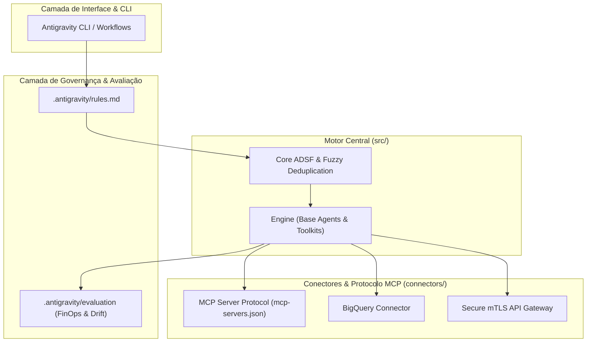

# 🧠 Arquiteto-IA — Infraestrutura Agêntica, Governança & Multi-Agent Engines

[](https://github.com/)
[](https://github.com/)
[-008080?style=for-the-badge&logo=connectors)](https://github.com/)
[](https://github.com/)

---

## 📌 Visão Geral & Papel Estratégico

Este repositório materializa o **Pilar 2 (Arquiteto-IA)** de um ecossistema agêntico de classe empresarial. O foco principal é demonstrar **engenharia de ponta**, **governança estrita**, **infraestrutura descentralizada via MCP (Model Context Protocol)** e **frameworks de orquestração agnósticos**.

### 🎯 Dimensão Profissional Validada
- **Senioridade Técnica & Inovação de Vanguarda:** Demonstração prática de padrões avançados de código, resiliência de sistemas distribuídos e orquestração determinística de LLMs/Agentes.
- **Governança Agêntica & FinOps:** Controle rigoroso de contexto, orçamento de tokens (FinOps) e prevenção de *drift* comportamental em produção.
- **Arquitetura Enterprise-Grade:** Integração segura com bancos de dados de escala corporativa, mTLS, pipelines automatizados e padrões ADR (*Architecture Decision Records*).

---

## 🏗️ Estrutura do Repositório (Repository Blueprint)

A arquitetura do repositório é organizada em um modelo de **Monorepo de Soluções & Governança Agêntica**, separando a infraestrutura mestre de IA, os artefatos de arquitetura e as aplicações/projetos práticos desenvolvidos.

```plaintext
Arquiteto-IA/
├── 🌐 conference-website/       # Aplicação Web (Google Cloud Summit 2026 — Flask/Docker/Cloud Run)
├── 📝 to-do-list-project-v01/    # Aplicação CRUD & Sandbox de Performance Assíncrona com Agentes
├── 🛡️ .antigravity/             # Governança Agêntica & Configurações de IA
│   ├── workflows/              # Pipelines automatizados do Antigravity CLI
│   ├── mcp-servers.json        # Registro dos servidores MCP (Model Context Protocol)
│   ├── rules.md                # Governança de contexto, guardrails e constraints
│   └── evaluation/             # Testes de drift, FinOps e auditoria de consumo de tokens
├── 🏛️ architecture/            # Desenho de Solução & Decisões Arquiteturais
│   ├── system-design.mermaid   # Diagramas C4 e fluxos visuais de orquestração
│   └── adr/                    # Architecture Decision Records (ADRs)
├── ⚙️ src/                      # Núcleo do Motor Agêntico (Engine & Core)
│   ├── core/                   # Lógica central (ADSF, fuzzy deduplication, parsers)
│   ├── connectors/             # Conectores de infraestrutura (BigQuery, mTLS, APIs)
│   └── engine/                 # Agentes base, toolkits e executores de tarefas
├── 💾 todo.db                  # Banco de dados SQLite persistente local
└── 📄 README.md                # Documentação mestre, mapa do monorepo e setup
```

---

## 🧩 Componentes Principais & Módulos

### 1. 🚀 Projetos & Soluções Práticas
- **`conference-website/`**: Website demonstrativo e responsivo desenvolvido como conceito para o *Google Cloud Summit 2026*. Criado em Flask, otimizado para deploy conteneirizado no **Google Cloud Run** via Artifact Registry, contando com testes automatizados e pipeline de CI/CD.
  - 🎨 **UI/UX Design:** [](https://www.figma.com/community/file/1672641463604834469)
- **`to-do-list-project-v01/`**: Aplicação de gerenciamento de tarefas de alta performance. Serviu como laboratório para otimização de rotinas síncronas vs. assíncronas concorrentes e demonstração de agentes de revisão automatizada de código (`.agents/`).
  - 🎨 **UI/UX Design:** [](https://www.figma.com/community/file/1672445777034034307)

### 2. 🛡️ Governança e Operações (`.antigravity/`)
- **`workflows/`**: Automações agênticas executadas via Antigravity CLI para CI/CD, testes contínuos e auditorias de código.
- **`mcp-servers.json`**: Registro descentralizado de servidores MCP (*Model Context Protocol*), permitindo extensibilidade segura de ferramentas e contextos externos.
- **`rules.md`**: Definição de regras de conduta, limites de atuação e diretrizes de governança aplicadas diretamente aos agentes.
- **`evaluation/`**: Suíte de testes automatizados para monitorar eficiência de custos (FinOps), latência e degradação de acurácia (*prompt drift*).

### 3. 🏛️ Desenho de Solução & ADRs (`architecture/`)
- **`system-design.mermaid`**: Modelagem C4 e diagramas de sequência detalhando a interação entre orquestradores, subagentes e ferramentas.
- **`adr/`**: Registro formal das decisões arquiteturais tomadas durante a evolução do projeto.

### 4. ⚙️ Núcleo de Engenharia (`src/`)
- **`core/`**: Implementação do **ADSF (Agent-Driven Solution Framework)**, algoritmos de *fuzzy deduplication* de contexto e parsers.
- **`connectors/`**: Camada de integração segura com BigQuery, mTLS e APIs de infraestrutura.
- **`engine/`**: Agentes base reutilizáveis, gerenciamento de estado e bibliotecas de ferramentas (*toolkits*).

---

## 📐 Fluxo Arquitetural (Orquestração de Agentes & MCP)



---

## 🚀 Quickstart & Setup do Motor

### Pré-requisitos
- **Node.js** v18+ ou **Python** 3.10+ (dependendo do módulo de execução)
- **Antigravity CLI** instalado e configurado
- Acesso configurado aos servidores MCP descritos em `.antigravity/mcp-servers.json`

### Instalação e Execução

1. **Clonar o Repositório:**
   ```bash
   git clone https://github.com/seu-usuario/Arquiteto-IA.git
   cd Arquiteto-IA
   ```

2. **Validar Servidores e Configurações MCP:**
   ```bash
   antigravity mcp status --config .antigravity/mcp-servers.json
   ```

3. **Executar Suíte de Testes de Governança e Drift:**
   ```bash
   antigravity run .antigravity/workflows/eval-drift.json
   ```

---

## 💡 Sugestões de Melhorias Recomendadas pelo Agente

Para elevar ainda mais o nível de maturidade e impacto deste repositório no seu perfil profissional, sugerimos as seguintes melhorias:

| Categoria | Sugestão de Melhoria | Benefício / Impacto |
| :--- | :--- | :--- |
| **Infraestrutura de Arquivo** | Criar fisicamente as pastas do esquema blueprint (`.antigravity/`, `architecture/`, `src/`) com arquivos *boilerplate* funcionais. | Demonstra execução real e código pronto para uso, indo além da documentação teórica. |
| **Diagramação C4** | Adicionar um arquivo `architecture/system-design.mermaid` completo com visualização C4 (Container/Component). | Facilita a leitura visual da arquitetura por Tech Leads e Arquitetos de Solução. |
| **FinOps & Token Metrics** | Criar um script Python/Node em `.antigravity/evaluation/` para calcular custo por requisição e eficiência de uso de tokens. | Valida a preocupação com FinOps e eficiência operacional de LLMs. |
| **ADR Templates** | Incluir um template padronizado de ADR em `architecture/adr/0001-template.md` (formato Michael Nygard). | Demonstra disciplina de documentação técnica enterprise. |
| **Conectores MOCK/SDK** | Implementar uma versão funcional ou mockup de integração em `src/connectors/bigquery.ts` / `.py`. | Comprova experiência técnica hands-on com mTLS e BigQuery. |

---

## 📄 Licença & Governança

- **Licença de Uso (MIT):** Este projeto é de código aberto sob a **Licença MIT**. Você pode usar, modificar e distribuir este código livremente para fins pessoais ou comerciais, **desde que mantenha os devidos créditos ao autor original**.
- **Governança Agêntica:** Para entender as regras de conduta, parâmetros e restrições aplicados aos agentes de IA durante a execução, consulte a especificação em [`.antigravity/rules.md`](file:///.antigravity/rules.md).
