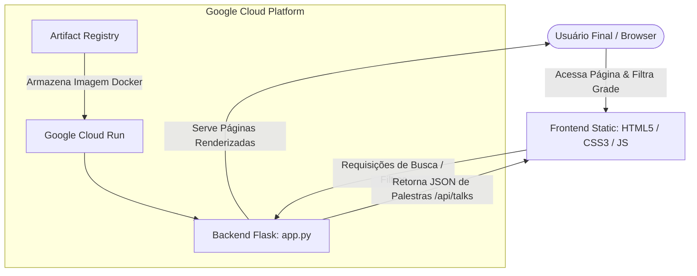

# 📌 Google Cloud Summit 2026 - Conference Website

Website oficial responsivo e dinâmico da conferência **Google Cloud Summit 2026**. O projeto oferece uma experiência moderna de grade de palestras interativa, integrando filtros em tempo real e um design premium baseado no design system do Google Cloud. A arquitetura é otimizada para implantação rápida em contêineres e serverless.

---

## 🏛️ Arquitetura da Solução e Fluxo de Dados

A arquitetura do projeto segue um modelo clássico de aplicação web conteneirizada de camada única/dupla (SPA-like frontend que consome uma API de backend Flask). É ideal para hospedagem serverless de alta escalabilidade utilizando o **Google Cloud Run**.

### 🎨 Design System & Especificação de Interface
- **Protótipo Interativo:** Desenvolvido no Figma Dev Mode como Single Source of Truth (SSoT) para a experiência visual e fluxo da aplicação.
- **Acesso ao Design:** [](https://www.figma.com/community/file/1672641463604834469)

### Diagrama da Solução



### Papel de Cada Camada no Ecossistema

1. **Frontend (Camada de Apresentação):**
   - Composta por [`index.html`](templates/index.html), [`style.css`](static/style.css) e [`script.js`](static/script.js).
   - Fornece um painel interativo (com suporte a Glassmorphism e Dark Mode) onde o usuário pode realizar filtros e pesquisas em tempo real de forma assíncrona.
2. **Backend (Camada de Aplicação):**
   - Gerenciado pelo script [`app.py`](app.py) que expõe rotas HTTP usando o framework Flask.
   - Fornece renderização no lado do servidor para a página principal (`/`) e expõe um endpoint REST de busca dinâmica (`/api/talks`).
3. **Infraestrutura / Deployment:**
   - O projeto é empacotado em uma imagem de contêiner ultraleve a partir do [`Dockerfile`](Dockerfile).
   - O deploy é orquestrado para o **Google Cloud Run**, permitindo auto-scaling de zero a infinito, otimizando latência e custo.

---

## 🛠️ Stack Tecnológica

| Tecnologia / Biblioteca | Versão | Função Principal |
| :--- | :--- | :--- |
| **Python** | `3.10-slim` | Runtime principal do Backend |
| **Flask** | `3.0.3` | Micro-framework para roteamento e API web |
| **Gunicorn** | `22.0.0` | Servidor HTTP WSGI de nível de produção para UNIX |
| **Pytest** | `8.2.2` | Framework de testes unitários e de integração |
| **HTML5 & CSS3** | Nativo | Estrutura semântica e estilização (Design System Premium) |
| **Vanilla JavaScript** | Nativo | Manipulação assíncrona do DOM e requisições HTTP locais |
| **Docker** | Core | Criação e empacotamento do contêiner da aplicação |

---

## 📁 Estrutura do Diretório

```text
conference-website/
├── .gitignore             # Regras rígidas para exclusão de arquivos sensíveis e caches
├── .env.example           # Modelo de variáveis de ambiente com placeholders seguros
├── app.py                 # Ponto de entrada do backend Flask e armazenamento fictício de palestras
├── Dockerfile             # Manifesto de build para geração da imagem de contêiner Python
├── requirements.txt       # Arquivo de especificação de dependências Python
├── test_app.py            # Suite de testes automatizados com pytest
├── deploy.sh              # Script de deploy automatizado para ambientes Linux/macOS
├── deploy.ps1             # Script de deploy automatizado para ambientes Windows (PowerShell)
├── static/                # Recursos estáticos do frontend
│   ├── script.js          # Lógica JavaScript cliente de busca e filtros dinâmicos
│   └── style.css          # Estilização com design system premium do Google Cloud
└── templates/             # Templates HTML
    └── index.html         # Template principal da aplicação web
```

---

## ⚙️ Variáveis de Ambiente e Configuração (Sanitizadas)

Abaixo estão listadas as variáveis de configuração exigidas pela aplicação e pelos scripts de infraestrutura. 

> [!IMPORTANT]  
> Todos os segredos e credenciais de ambiente devem ser configurados localmente em um arquivo `.env` ou injetados diretamente na nuvem (Secrets Manager/Cloud Run Env). Nunca armazene credenciais reais no repositório.

| Variável | Exemplo Seguro | Descrição |
| :--- | :--- | :--- |
| `GCP_PROJECT_ID` | `gcp-summit-production` | ID do projeto da Google Cloud Platform para deploy e faturamento |
| `GCP_REGION` | `us-central1` | Região onde a infraestrutura e recursos do Cloud Run serão criados |
| `BIGQUERY_DATASET` | `conference_analytics` | Dataset para integração de análise de dados (caso aplicável) |
| `FLASK_APP` | `app.py` | Especifica o arquivo principal da aplicação Flask |
| `FLASK_ENV` | `production` / `development` | Controla o comportamento do ambiente (ativação de debug, etc.) |
| `PORT` | `8080` | Porta TCP em que o Gunicorn/Flask escutará as requisições |

---

## 🚀 Como Executar Localmente

Siga o passo a passo abaixo para configurar e rodar o projeto localmente em sua máquina.

### Passo 1: Preparar o Ambiente Virtual

No Windows:
```powershell
python -m venv venv
venv\Scripts\activate
```

No macOS/Linux:
```bash
python3 -m venv venv
source venv/bin/activate
```

### Passo 2: Instalar Dependências

Com o ambiente virtual ativado, instale as dependências contidas no [`requirements.txt`](requirements.txt):
```bash
pip install -r requirements.txt
```

### Passo 3: Criar Arquivo de Configurações Locais

Copie o arquivo [`.env.example`](.env.example) para `.env` e configure conforme seu ambiente:
```bash
cp .env.example .env
```

### Passo 4: Executar a Aplicação

Inicie o servidor Flask:
```bash
python app.py
```
Acesse a aplicação no navegador em `http://localhost:8080`.

### Passo 5: Executar Testes Automatizados

O projeto vem com cobertura de testes unitários em [`test_app.py`](test_app.py). Execute usando o comando:
```bash
pytest
```

---

## ☁️ Instruções de Build e Deploy (GCP)

### Build Local da Imagem Docker

Para validar o contêiner localmente, execute o build a partir do [`Dockerfile`](Dockerfile):
```bash
docker build -t gcr.io/seu-projeto-id/conference-website:latest .
```

### Deploy no Google Cloud Run

#### Linux/macOS
Execute o script de deploy automatizado em shell bash:
```bash
chmod +x deploy.sh
./deploy.sh
```

#### Windows
Execute o script PowerShell para deploy:
```powershell
Set-ExecutionPolicy -Scope Process -ExecutionPolicy Bypass
.\deploy.ps1
```

O script obterá o ID do seu projeto padrão configurado na CLI da Google Cloud (`gcloud`) e realizará o deploy automático do serviço no Cloud Run de forma pública e com porta mapeada para a porta do contêiner (`8080`).

---

## 💡 Sugestões de Evolução e Próximos Passos (Recomendações do Arquiteto)

> [!NOTE]  
> Durante a auditoria de segurança do código-fonte e análise de infraestrutura, **não foi identificada nenhuma credencial exposta ou fixada diretamente (hardcoded)** no repositório.

Para evoluir este sistema para nível empresarial, considere os seguintes pontos de arquitetura:

1. **Separação de Dados (Banco de Dados)**
   - Atualmente, as palestras e horários estão em memória dentro de `TALKS_DATABASE` no arquivo [`app.py`](app.py). Recomenda-se migrar estes dados para o **Google Cloud Firestore** (NoSQL rápido e escalável) ou **Cloud SQL (PostgreSQL)** para permitir a edição em tempo real sem redeploys.
2. **Integração de Cache com Cloud CDN**
   - Por ser um site informativo de alta demanda no dia do evento, a integração com o **Google Cloud CDN** ou cache em nível de borda (Edge Caching) nas rotas estáticas (`/` e `/api/talks`) mitigaria os custos com processamento do Cloud Run e melhoraria o tempo de resposta global.
3. **Gerenciamento Seguro de Segredos com GCP Secret Manager**
   - Se chaves de API externas ou conexões com bancos de dados forem adicionadas à aplicação no futuro, configure o Cloud Run para ler essas credenciais de forma segura através de variáveis de ambiente alimentadas diretamente pelo **Google Secret Manager**.
