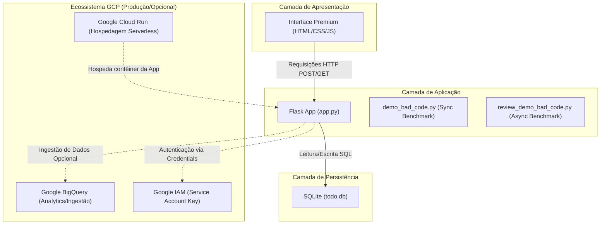

# 📝 To-Do List Premium & Asynchronous Sandbox

Este repositório contém uma aplicação web completa de gerenciamento de tarefas (CRUD) de alta performance e com interface premium, além de um laboratório integrado para demonstração e análise comparativa de otimização de performance (síncrona vs. assíncrona concorrente) em Python.

---

## 1. 📌 Visão Geral do Projeto

O objetivo principal de negócio desta solução é fornecer um gerenciador de tarefas altamente responsivo e intuitivo, servindo também como base de referência arquitetural para:
1. **CRUD Rápido e Seguro**: Gerenciamento de tarefas em banco de dados local estruturado, pronto para migração para a nuvem.
2. **Laboratório de Performance**: Sandbox didático para otimização de loops de IO bloqueantes e pesquisas lineares $O(N)$ em estruturas de dados na memória.
3. **Prontidão Cloud-Native**: Configurações preparadas para integração e deploy no ecossistema **Google Cloud Platform (GCP)**.

---

## 2. 🏛️ Arquitetura da Solução e Fluxo de Dados

A arquitetura do ecossistema é projetada de forma desacoplada, separando a apresentação visual, o controle lógico de requisições, a camada de banco de dados e os módulos analíticos ou utilitários assíncronos.

### Diagrama de Arquitetura e Fluxo de Dados



### Papel de Cada Camada
- **Interface Premium (Frontend)**: Localizada em [`templates/index.html`](file:///c:/Users/Usu%C3%A1rio/Documents/antigravity-git/to-do-list-project-v01/templates/index.html), utiliza HTML5 semântico e CSS3 customizado com efeito *glassmorphism*, variáveis de cor modernas (Plus Jakarta Sans) e controles dinâmicos de estado sem dependências de frameworks JS externos.
- **Flask App (Backend)**: Executado no [`app.py`](file:///c:/Users/Usu%C3%A1rio/Documents/antigravity-git/to-do-list-project-v01/app.py), gerencia o roteamento HTTP das ações CRUD (adicionar, alternar status, editar e deletar) e conexões com o SQLite.
- **SQLite (Persistência)**: Armazena as tarefas no arquivo local `todo.db` estruturado na tabela `tasks` criada automaticamente através de [`init_db()`](file:///c:/Users/Usu%C3%A1rio/Documents/antigravity-git/to-do-list-project-v01/app.py#L12).
- **Sandbox Comparativo**: Os scripts [`demo_bad_code.py`](file:///c:/Users/Usu%C3%A1rio/Documents/antigravity-git/to-do-list-project-v01/demo_bad_code.py) (síncrono ineficiente) e [`review_demo_bad_code.py`](file:///c:/Users/Usu%C3%A1rio/Documents/antigravity-git/to-do-list-project-v01/review_demo_bad_code.py) (assíncrono concorrente com loops paralelos e mapeamento hash $O(1)$) atuam isoladamente como um laboratório de testes de desempenho de algoritmos.
- **Serviços GCP (Prontidão de Nuvem)**: Configurações integradas via arquivo `.env` para exportação analítica e deploy automatizado em microsserviço serverless.

---

## 3. 🛠️ Stack Tecnológica

| Tecnologia / Biblioteca | Versão Declarada | Tipo | Função no Ecossistema |
| :--- | :--- | :--- | :--- |
| **Python** | `3.10+` | Linguagem | Motor principal do backend da aplicação e scripts de sandbox. |
| **Flask** | `3.0.3` | Framework Web | Gerenciamento de rotas, controle do ciclo de requisições e injeção do template. |
| **SQLite3** | *(Nativo)* | Banco de Dados | Mecanismo de persistência relacional local leve. |
| **HTML5 / CSS3 / JS** | *(Nativo)* | Frontend | Interface web com variáveis CSS globais de estilo e interações JavaScript nativas. |
| **Asyncio** | *(Nativo)* | Concorrência | Biblioteca base para o processamento assíncrono paralelo no sandbox. |

---

## 4. 📁 Estrutura do Diretório

Abaixo está a árvore real de arquivos e pastas no workspace com links e propósitos definidos:

```bash
to-do-list-project-v01/
├── .agents/                     # Configurações locais de agentes inteligentes.
├── templates/                   # Diretório de views (templates) do Flask.
│   └── index.html               # Frontend Premium com CSS/JS embutidos.
├── .env.example                 # Arquivo de configuração de ambiente (sanitizado).
├── .gitignore                   # Lista de caminhos ignorados pelo controle de versão Git.
├── app.py                       # Ponto de entrada do Flask, definindo rotas e CRUD de tarefas.
├── demo_bad_code.py             # Script de demonstração síncrona com busca linear O(N).
├── requirements.txt             # Dependências de pacotes da aplicação Python.
├── review_demo_bad_code.py      # Refatoração assíncrona O(1) usando asyncio.gather.
└── todo.db                      # Banco de dados SQLite local (gerado em runtime).
```

### Links Diretos para os Arquivos do Workspace
* 🌐 **Módulos Principais**:
  * [app.py](file:///c:/Users/Usu%C3%A1rio/Documents/antigravity-git/to-do-list-project-v01/app.py)
  * [templates/index.html](file:///c:/Users/Usu%C3%A1rio/Documents/antigravity-git/to-do-list-project-v01/templates/index.html)
* 🧪 **Sandbox Otimizado**:
  * [demo_bad_code.py](file:///c:/Users/Usu%C3%A1rio/Documents/antigravity-git/to-do-list-project-v01/demo_bad_code.py)
  * [review_demo_bad_code.py](file:///c:/Users/Usu%C3%A1rio/Documents/antigravity-git/to-do-list-project-v01/review_demo_bad_code.py)
* ⚙️ **Configuração de Dependências e Ambiente**:
  * [.env.example](file:///c:/Users/Usu%C3%A1rio/Documents/antigravity-git/to-do-list-project-v01/.env.example)
  * [requirements.txt](file:///c:/Users/Usu%C3%A1rio/Documents/antigravity-git/to-do-list-project-v01/requirements.txt)
  * [.gitignore](file:///c:/Users/Usu%C3%A1rio/Documents/antigravity-git/to-do-list-project-v01/.gitignore)

---

## 5. ⚙️ Variáveis de Ambiente e Configuração (Sanitizadas)

Utilize as seguintes definições para configurar o seu arquivo `.env` local. Nenhuma credencial confidencial deve ser versionada.

> [!WARNING]
> Nunca versione chaves de acesso reais, senhas de banco ou chaves JSON de Service Accounts do GCP. O arquivo `.gitignore` já bloqueia os arquivos `.env` e formatos de chaves para evitar vazamentos acidentais.

| Variável de Ambiente | Descrição | Valor de Exemplo Seguro |
| :--- | :--- | :--- |
| `GCP_PROJECT_ID` | Identificador único do projeto no Google Cloud Platform. | `"seu-projeto-gcp"` |
| `GCP_REGION` | Região recomendada para provisionamento no GCP. | `"us-central1"` |
| `BIGQUERY_DATASET` | Nome do dataset analítico configurado no BigQuery. | `"seu_dataset_analytics"` |
| `GOOGLE_APPLICATION_CREDENTIALS` | Caminho relativo/absoluto para a credencial JSON do IAM. | `"secrets/gcp-service-account.json"` |
| `FLASK_APP` | Script principal que inicia a aplicação web. | `"app.py"` |
| `FLASK_ENV` | Modo operacional do Flask (desenvolvimento/produção). | `"development"` |
| `FLASK_DEBUG` | Flag para ativação do debug interativo e reinício automático. | `1` |
| `SECRET_KEY` | Chave criptográfica usada para segurança de sessões. | `"chavesecreta-segura-e-gerada-aleatoriamente"` |

---

## 6. 🚀 Como Executar Localmente

### Pré-requisitos
- Python 3.10 ou superior instalado na máquina.

### Passo 1: Configurar o Ambiente Virtual
No Windows (PowerShell):
```powershell
python -m venv venv
.\venv\Scripts\Activate.ps1
```
No Linux/macOS:
```bash
python3 -m venv venv
source venv/bin/activate
```

### Passo 2: Instalar as Dependências
Instale os pacotes definidos no [requirements.txt](file:///c:/Users/Usu%C3%A1rio/Documents/antigravity-git/to-do-list-project-v01/requirements.txt):
```bash
pip install -r requirements.txt
```

### Passo 3: Inicializar Variáveis de Ambiente
Crie uma cópia do arquivo [.env.example](file:///c:/Users/Usu%C3%A1rio/Documents/antigravity-git/to-do-list-project-v01/.env.example) e preencha as variáveis locais em seu `.env`:
```bash
cp .env.example .env
```

### Passo 4: Executar a Aplicação Web
```bash
python app.py
```
Acesse localmente em: 👉 [http://localhost:5000](http://localhost:5000)

### Passo 5: Rodar os Benchmarks de Desempenho (Opcional)
Execute os scripts para comparar os tempos de processamento síncrono bloqueante e assíncrono:
```bash
# Executa a versão lenta (Busca linear O(N) + Time blocking)
python demo_bad_code.py

# Executa a versão assíncrona (Busca O(1) + Concorrência Asyncio)
python review_demo_bad_code.py
```

---

## 7. ☁️ Instruções de Build e Deploy (GCP)

Siga este procedimento para conteinerizar e hospedar a aplicação de forma serverless usando o **Google Cloud Run**.

### 🐳 1. Dockerfile Recomendado
Crie um arquivo chamado `Dockerfile` na raiz do projeto com o seguinte conteúdo:

```dockerfile
# Imagem base oficial otimizada do Python
FROM python:3.10-slim

# Impede geração de arquivos compilados .pyc e força escrita de logs imediata
ENV PYTHONDONTWRITEBYTECODE=1
ENV PYTHONUNBUFFERED=1

WORKDIR /app

# Instala dependências do sistema e de pacotes Python
COPY requirements.txt .
RUN pip install --no-cache-dir -r requirements.txt

# Copia os arquivos do projeto para o contêiner
COPY . .

# Expõe a porta que a aplicação escutará
EXPOSE 8080

# Inicializa usando Gunicorn para escalabilidade multiprocesso (adicione gunicorn ao requirements.txt)
CMD ["gunicorn", "--bind", "0.0.0.0:8080", "app:app"]
```

### 📦 2. Comandos de Build e Deploy via gcloud CLI

Execute os seguintes comandos no terminal utilizando valores genéricos para hospedar sua aplicação:

```bash
# 1. Definir parâmetros da aplicação
GCP_PROJECT="seu-projeto-gcp"
GCP_REGION="us-central1"
SERVICE_NAME="todo-list-app"

# 2. Compilar a imagem de contêiner no Google Cloud Build
gcloud builds submit --tag gcr.io/$GCP_PROJECT/$SERVICE_NAME --project $GCP_PROJECT

# 3. Fazer deploy do microsserviço no Cloud Run
gcloud run deploy $SERVICE_NAME \
    --image gcr.io/$GCP_PROJECT/$SERVICE_NAME \
    --platform managed \
    --region $GCP_REGION \
    --allow-unauthenticated \
    --project $GCP_PROJECT \
    --set-env-vars FLASK_ENV=production,FLASK_DEBUG=0
```

---

## 💡 8. Sugestões de Evolução e Próximos Passos (Recomendações do Arquiteto)

Após inspeção detalhada do código-fonte e análise de segurança e infraestrutura, seguem as recomendações formais:

### 1. Migração de Persistência Local para Cloud SQL (Arquitetura Cloud-Native)
* **Problema Identificado**: O uso do banco de dados SQLite local (`todo.db`) cria acoplamento de estado nas instâncias do servidor Flask. Em ambientes serverless como o Google Cloud Run, os contêineres são efêmeros (são reiniciados, desligados ou escalados a qualquer momento), o que causará perda permanente ou inconsistência de dados entre instâncias paralelas.
* **Recomendação**: Migrar a persistência de dados para um banco gerenciado, como **Google Cloud SQL (PostgreSQL/MySQL)** ou um banco de documentos como **Firestore/Datastore**, permitindo escalonamento horizontal sem perda de dados.

### 2. Implementação de ORM e Proteção contra SQL Injection
* **Problema Identificado**: Em [`app.py`](file:///c:/Users/Usu%C3%A1rio/Documents/antigravity-git/to-do-list-project-v01/app.py), as interações com o SQLite são feitas com strings SQL montadas dinamicamente. Embora parâmetros seguros sejam usados em inserts, a ausência de um framework centralizado para manipulação de modelos dificulta a validação estática e o crescimento do esquema.
* **Recomendação**: Adotar o **SQLAlchemy** ou **Flask-SQLAlchemy** como ORM para gerenciar o esquema de dados, abstraindo consultas e garantindo validações robustas em tempo de design.

### 3. Gerenciamento Seguro de Credenciais de Produção via Secret Manager
* **Problema Identificado**: As variáveis de ambiente de segredo (como `SECRET_KEY` ou chaves de conta de serviço GCP) dependem de arquivos estáticos em disco (`.env` ou arquivos JSON em caminhos físicos).
* **Recomendação**: Integrar a aplicação ao **Google Cloud Secret Manager**. Durante o deploy no Cloud Run, as variáveis secretas podem ser injetadas diretamente na memória do contêiner sem a necessidade de expor arquivos sensíveis em builds ou no repositório Git.
